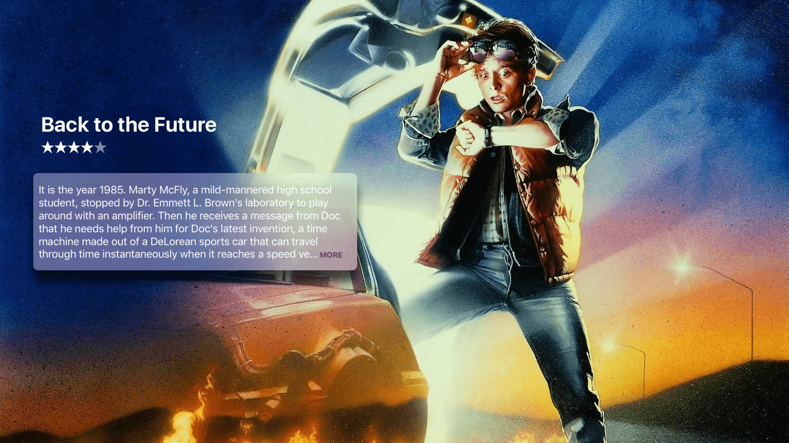

# TvOSMoreButton
> 📺 A tvOS button which truncates long text with '... More'.

The TvOSMoreButton is a simple view which aims to mirror the behavior of Apple's "... More" button; as seen in the Movie App.



## Features

If the text is too long to fit with in the button bounds then the text will be truncated and '... More' will be appended.

If the text fits with in the bounds of the button then the button is not focusable.

When the button is focused, pressing select on the Apple TV remote will trigger a callback.

The majority of the UI properties are configurable; like
- the button text
- ellipse text; defaults to '...'
- trailing text; defaults to "More"
- trailing text color and font
- the button text color and font
- shadows and radius
- and More 😉

## Requirements

- tvOS 9.0+
- Xcode 9

## Installation

#### CocoaPods
You can use [CocoaPods](http://cocoapods.org/) to install `TvOSMoreButton` by adding it to your `Podfile`:

```ruby
platform :tvos, '9.0'
use_frameworks!
pod 'TvOSMoreButton'
```

## Usage example

Please check out the Example workspace for more details.

```swift
    import TvOSMoreButton

    private func setUpUI() {
        tvOSMoreButton.text = // Super long text
        tvOSMoreButton.buttonWasPressed = moreButtonWasPressed
    }

    private func moreButtonWasPressed(text: String?) -> Void {
        // Do something. May I suggest using TvOSTextViewerViewController
        // to display the text in a full screen view!
        let viewController = TvOSTextViewerViewController()
        viewController.text = text
        viewController.textColor = .white
        viewController.textEdgeInsets = UIEdgeInsets(top: 100, left: 250, bottom: 100, right: 250)
        present(viewController, animated: true)
    }

```

If you would like to display a fullscreen view with just the text then definitely check out [@dcordero](https://github.com/dcordero)'s awesome [TvOSTextViewer](https://github.com/dcordero/TvOSTextViewer). So good!

## Contribute

We would love for you to contribute to **TvOSMoreButton**, check the ``LICENSE`` file for more info. Feel free to submit any issues or PRs. ❤️

## Meta

Special thanks [@mona-zsh](https://github.com/mona-zsh) for her fantastic article on [String Truncation](http://eskimona.com/coding/objective-c/2015/05/10/truncation.html).

Chris Goldsby – [@goldsbychris](https://twitter.com/goldsbychris)

Distributed under the MIT license. See ``LICENSE`` for more information.
